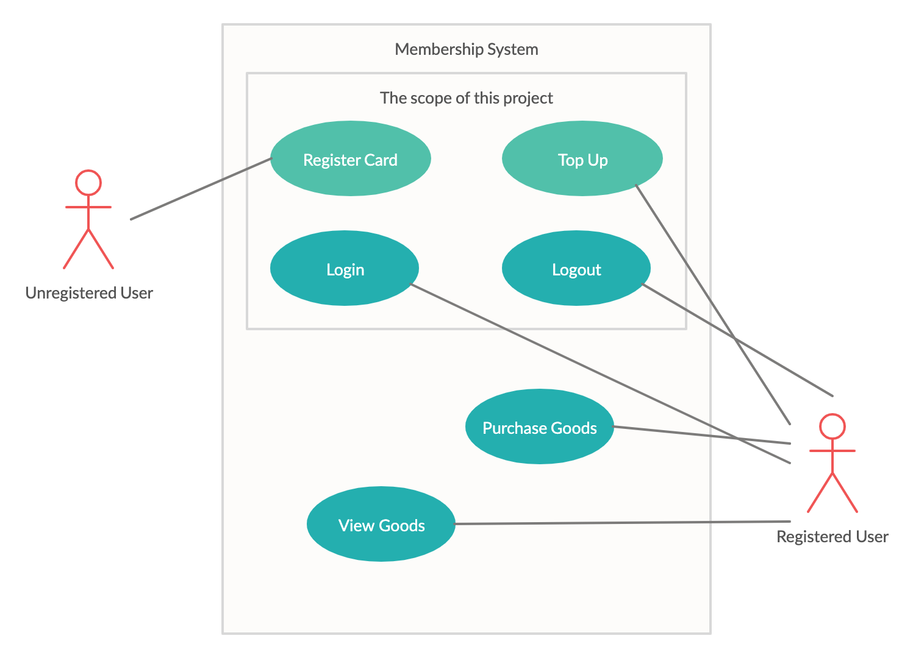
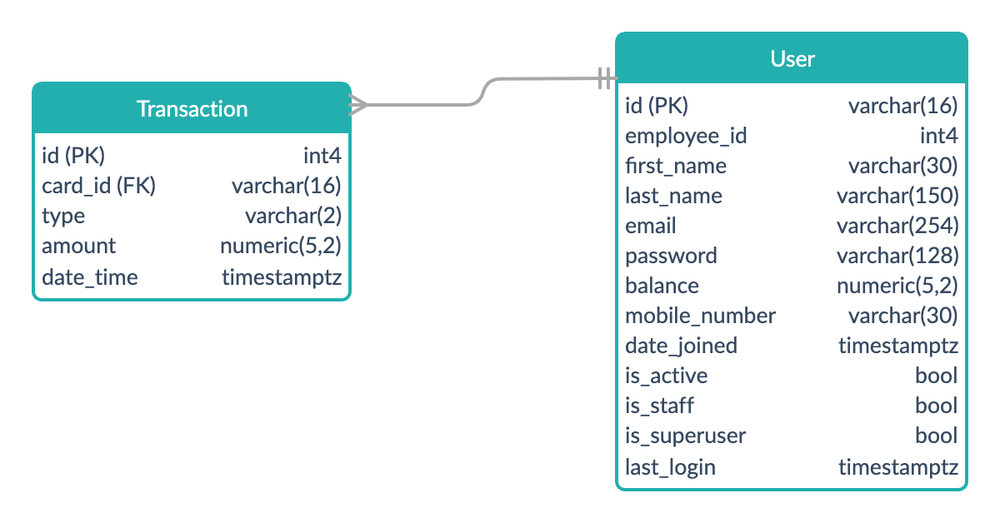
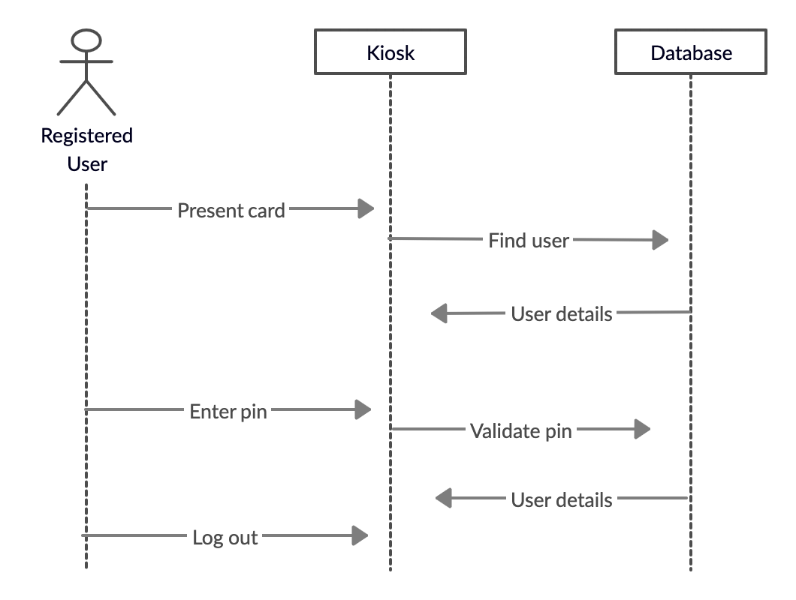

# bows_membership_system
Design and Build a RESTful API membership card system
## Designs
### Use Cases

Before a user can perform any tasks, they must first register their card. Registered users can top up their cards, login and logout. The system will be used to view and purchase goods, however that is outside the scope of this project.
### Data Model

#### User Table
The User table allows an employee to register their card on the system and to top up their balance.

I've made a design decision to extend Django's AbstractUser model which includes some fields by default such as date_joined and is_active to allow for user management on the admin console.

I will use AbstractUser's password field to store the pin number. I will later implement a password validator which checks that the pin is a four-digit number when a new user is registering.

I will store the balance as the numeric type with a precision of 5 and a scale of 2. This allows for numbers up to the value of 999.99 which should be sufficient for this project.
#### Transaction Table
The Transaction table allows the user to top up their balance, and could potentially be used for the purchase of goods which is outside the scope of this project.

There is a one-to-many relationship to this table, allowing a single user can be associated with multiple transactions. The foreign key will be the id field from the User table.

The transaction type will be stored as two characters. Top ups will be stored as 'TU' and purchases will be stored as 'PU'.
### Sequence Diagram

This diagram shows how the registered user interacts with the kiosk to perform the tasks of logging in and out. A limitation of this design is that it doesn't show registering a new user.
