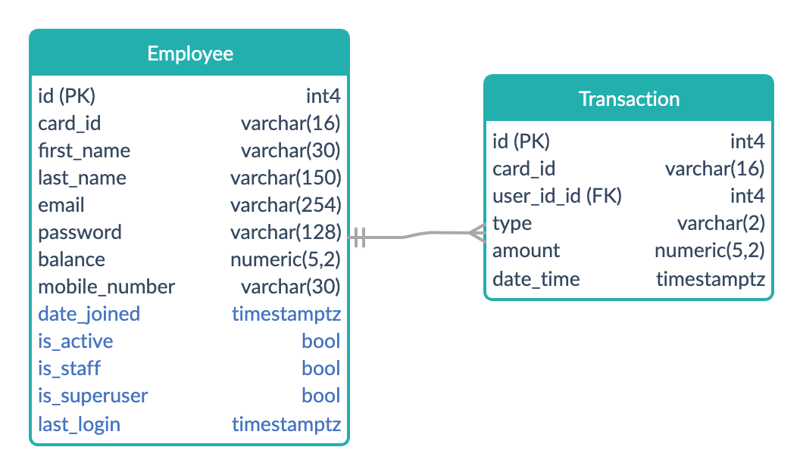

# Designing the Project
## Assumptions
* Functionality for viewing and purchasing goods may be implemented on the API at a later date
* Employee IDs are numerical and 4-byte integer is sufficient to represent them
* Users only have one card (at a time)
* Users may need to update their card id, for example to replace a lost card
* Registering a new card with user details that already exist will overwrite the currently stored card number
* Users do not have a separate username to their employee id so this will be used as a username
* The pin number will be used to login
* When a User record is deleted, all associated Transaction records will also need be deleted
* As the User table will not story a history of previous cards, the Transaction table will need to store the card number
used which will not be updated when a user updated their card number
## Changes and Additions made to the requirements
* Employee IDs will be a six digits
* Users will receive confirmation of the amount and new balance after a top up
* Admins will be able to manage the users and transactions from the admin console
## Designs
### Use Cases

A user who has not yet logged in can retrieve basic user details when providing their Card ID. They can also login or
register. Logged-in users can view more details such as their balance and the date they last logged in. They can also
top up their cards and logout.
### Data Model

#### User Table
The Employee table allows the user to register their card on the system and to top up their balance.

I've made a design decision to extend Django's AbstractUser model which includes some fields by default (highlighted in
light blue) to allow for user management on the admin console.

I will use AbstractUser's password field to store the pin number. I will implement a password validator which checks
that the pin is a four-digit number when a new user is registering.

I will store the balance as the numeric type with a precision of 5 and a scale of 2. This allows for numbers up to the
value of 999.99 which should be sufficient for this project.
#### Transaction Table
The Transaction table stores details of top ups, and could potentially be used to store the details of purchases of
goods.

There is a one-to-many relationship to this table, allowing a single user to be associated with multiple transactions.
The foreign key will be the id field from the User table.

The transaction type will be stored as two characters. Top ups will be stored as 'TU' and purchases will be stored as
'PU'.
### Sequence Diagram

This diagram shows how the registered user interacts with the kiosk to perform the tasks of logging in and out. A
limitation of this design is that it doesn't show registering a new user.
