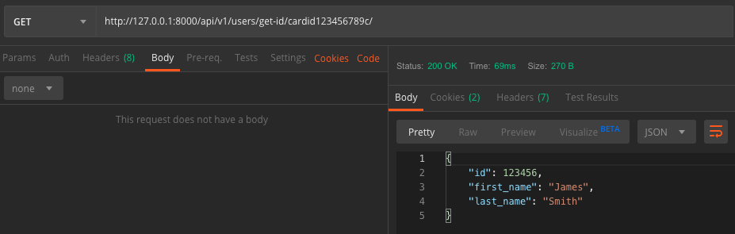

## Get ID
#### Description
User can retrieve basic details when providing a card number

#### Action Taken

Here I have executed the get-id endpoint and provided in the path a card id that exists in the database.
#### Expected Outcome
A 200 response code should be given. The response should be in JSON format and provide the user's id, first name and
last name.
#### Results
Pass
