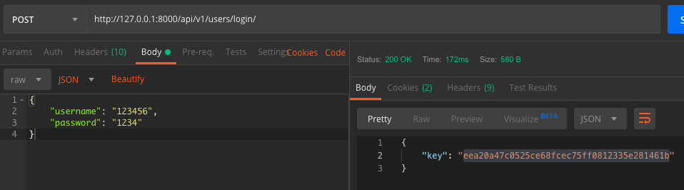

## Login
#### Description
User can login with their username and password, and receive an Authorisation Token
#### Action Taken

Here I have executed the login endpoint using a POST request. I have provided in the request body a username and
password that exist in the database.
#### Expected Outcome
A 200 response code should be given. The response should be in JSON format and provide the Authentication Token.
#### Results
Pass
