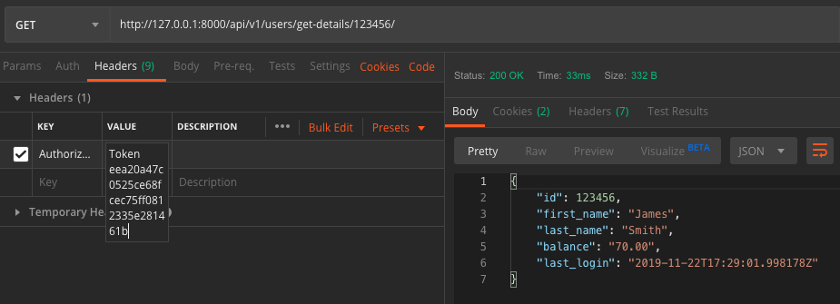

## Get Balance
#### Description
User can retrieve further details such as balance
#### Action Taken

Here I have executed the get-details endpoint using a GET request. I have added the Authorisation Token as a header.
I have provided in the path a user id that exists in the database
#### Expected Outcome
A 200 response code should be given. The response should be in JSON format and provide the user details including
id, first name, last name, balance and last login.
#### Results
Pass
