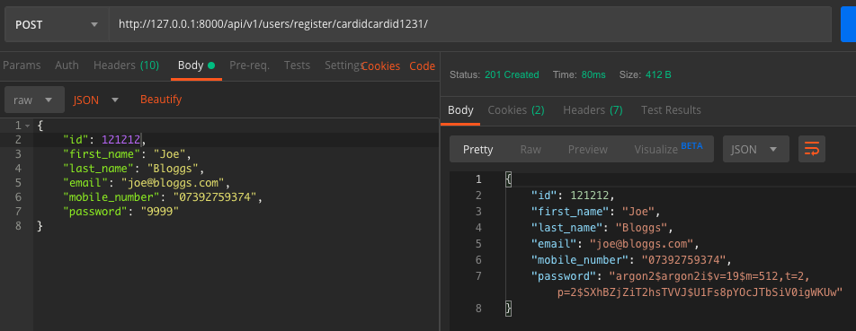

## Register
#### Description
User can register a new account
#### Action Taken

Here I have executed the register endpoint using a POST request.
I have provided in the path a card id that doesn't exist in the database.
As I provided the card number in the path, it is not required in the request body.
In the request body I've provided the required details to create a new user.
#### Expected Outcome
A 200 response code should be given.
The response should be in JSON format and provide the user details to confirm they successfully registered.
#### Results
Pass
