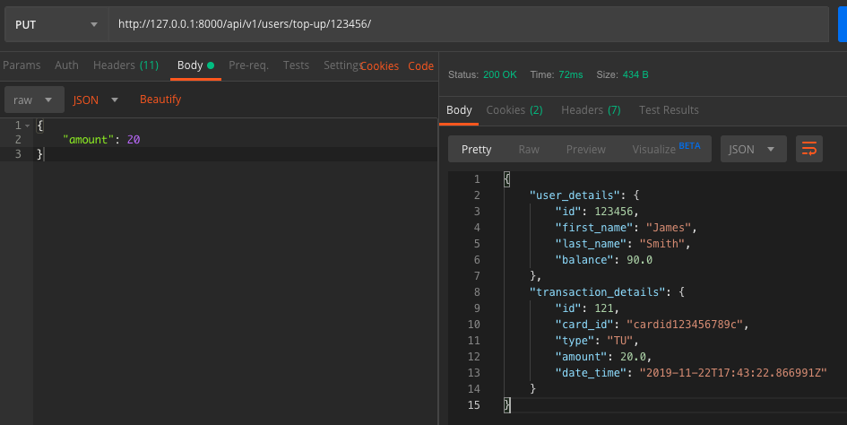

## Top Up
#### Description
User can Top Up their balance
#### Action Taken

Here I have executed the top-up endpoint using a PUT request.
I have provided in the path a user id that exists in the database.
I have provided the Authorisation Token as a header.
As I provided the user id in the path, it is not required in the request body.
In the request body I've provided the amount to be topped up.
#### Expected Outcome
A 200 response code should be given.
The response should be in JSON format and provide a nested response containing the user details and transaction details.
When executing the test again, the balance should be updated, and the database should show the updated balance.
The database should show a new Transaction record.
#### Results
Pass
