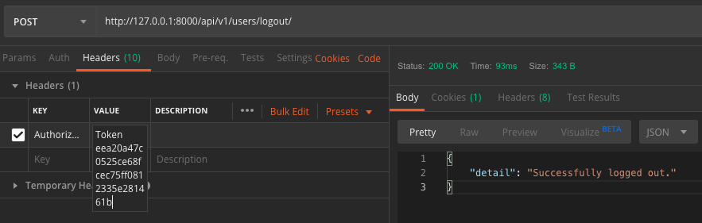

## Logout
#### Description
User can Logout, deleting their token
#### Action Taken

Here I have executed the logout endpoint using a POST request.
I have provided the Authorisation Token as a header.
#### Expected Outcome
A 200 response code should be given.
The response should be in JSON format and should confirm that the user has logged out.
The database should show the token in the database before executing, and then should be deleted after.
#### Results
Pass
